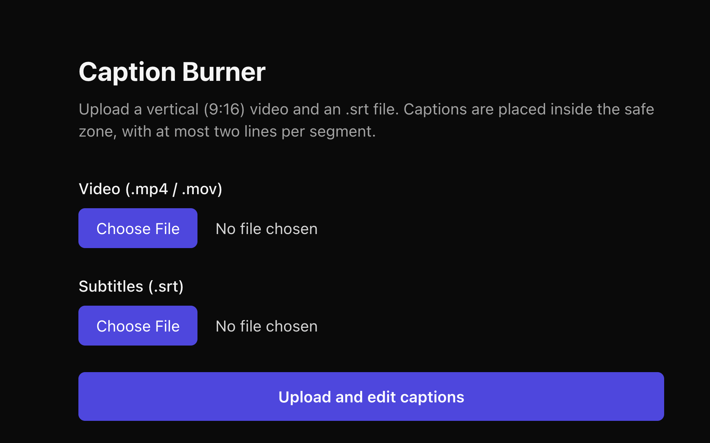

# Caption Burner

[](https://nextjs.org/)
[](https://react.dev/)
[](https://www.typescriptlang.org/)
[](https://ffmpeg.org/)


A focused web app for editing SRT subtitles and burning them directly into vertical MP4 videos, with a live safe-zone preview designed for **Instagram Reels**, **TikTok**, and **YouTube Shorts**.



## Features

- **Video and SRT Upload** - Import MP4 or MOV videos together with an SRT subtitle file
- **Live Preview** - See each caption over the video at its exact timestamp
- **Segment Editor** - Update subtitle text, start time, and end time independently
- **Smart Line Breaks** - Balance caption text across two lines at the nearest word boundary
- **Time Splitting** - Divide long captions into two consecutive timed segments
- **Safe-Zone Validation** - Detect empty text, overlapping timestamps, invalid durations, and overflow
- **Short-Form Layout** - Keep text clear of platform controls on vertical 9:16 videos
- **Burned-In Captions** - Render styled subtitles into an H.264 MP4 with FFmpeg
- **Render Progress** - Follow processing status and download the completed video

## Usage

1. Select a vertical MP4 or MOV video.
2. Select the corresponding SRT subtitle file.
3. Choose **Upload and edit captions**.
4. Select a segment to preview and edit its text or timing.
5. Use **Break line** or **Split in time** when a caption needs adjustment.
6. Resolve any highlighted validation errors.
7. Choose **Finish and render**, then download the completed MP4.

## Caption Rules

| Rule | Limit |
|---|---|
| Video size | 600 MB maximum |
| Video duration | 10 minutes maximum |
| Recommended aspect ratio | 9:16 vertical |
| Caption lines | 2 per segment |
| Recommended line length | 34 characters |

Captions are rendered in white over a black background near the bottom of the frame. The layout reserves space for platform interface elements at the top, bottom, and right side of the video.

## Requirements

- Node.js 20.9 or later
- npm
- FFmpeg and ffprobe available on your `PATH`

On macOS, install FFmpeg with Homebrew:

```bash
brew install ffmpeg
```

Verify the installation:

```bash
ffmpeg -version
ffprobe -version
```

## Installation

Clone the repository and install the dependencies:

```bash
git clone https://github.com/cyz/captions.git
cd captions
npm install
```

Run the development server:

```bash
npm run dev
```

Open [http://localhost:3000](http://localhost:3000) in your browser.

## Production

Create and run an optimized production build:

```bash
npm run build
npm start
```

## Architecture

The application uses the Next.js App Router and Node.js route handlers. Uploaded files and job metadata are stored under `data/jobs/<jobId>` and are intentionally excluded from Git.

```text
Video + SRT upload
	|
	v
ffprobe metadata inspection
	|
	v
SRT parsing and validation
	|
	v
Caption editing and safe-zone preview
	|
	v
Canvas PNG overlays -> FFmpeg composition -> MP4 download
```

Key directories:

```text
app/          Pages and API route handlers
components/   Reusable interface components
lib/          SRT, safe-zone, storage, queue, canvas, and FFmpeg logic
data/         Local runtime files (not committed)
```

### API Routes

| Route | Purpose |
|---|---|
| `POST /api/upload` | Store the source files and create a processing job |
| `GET /api/segments/:jobId` | Load video metadata and subtitle segments |
| `PUT /api/segments/:jobId` | Save edited subtitle segments |
| `GET /api/preview/:jobId` | Stream the source video to the editor |
| `POST /api/render/:jobId` | Queue the caption rendering job |
| `GET /api/status/:jobId` | Report rendering status and progress |
| `GET /api/download/:jobId` | Download the rendered MP4 |

## Deployment Notes

This project requires a Node.js server with:

- FFmpeg and ffprobe installed
- A writable, persistent filesystem for the `data` directory
- Enough memory and execution time to process uploaded videos

GitHub Pages cannot run this application because it only serves static files. Serverless platforms with ephemeral filesystems or short execution limits will require replacing local storage and the in-process queue with persistent object storage and a background worker.

### Netlify

Netlify can deploy the interface and Next.js route handlers, but the current video-processing backend is not compatible with its serverless runtime. Upload and rendering require persistent storage, FFmpeg and ffprobe binaries, and a worker that continues running after the API response. Use a persistent Node.js or container host, or move storage and rendering to dedicated external services before using Netlify in production.

## Available Scripts

- `npm run dev` starts the development server
- `npm run build` creates a production build
- `npm start` runs the production server
- `npm run check` runs the TypeScript compiler without emitting files
